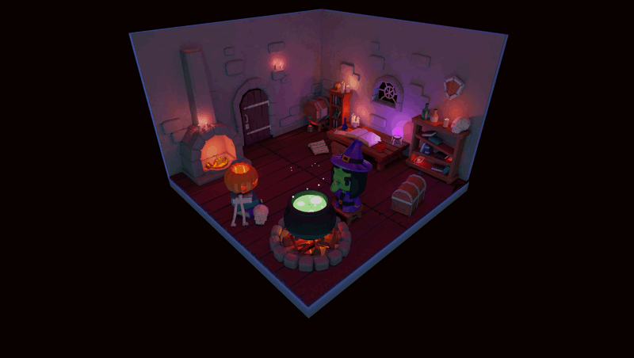

# 🧙🏻‍♀️ The Witch's lair

A 3D scene created with React Three Fiber.

You can enter the lair [here](https://witch-lair.vercel.app/), but beware of what you find!

## 🔮 Ingridients

- Use a mouse to rotate the scene
- You can interact with certain elements. Try clicking one of these:
  - 🔮 Crystal Ball
  - 🍵 Cauldron
  - 🧪 Magic potions
  - 🧙🏻‍♀️ The Witch!

## 🕹️ Dev Commands

`npm i`

`npm run dev`

`npm run build`

`npm run preview`
